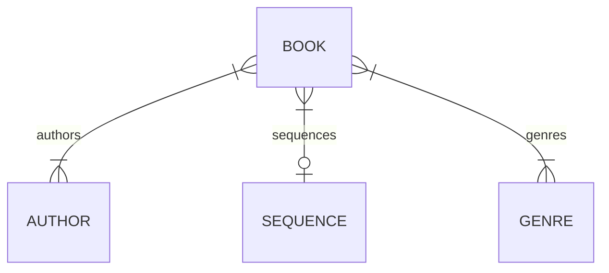

# <logos-ktor-icon /> and <Htmx />

## The match made on heaven

Pasha Finkelshteyn

---

# Who am I anyways

<v-clicks>

- ex-JetBrains
- Kotlin fanboy, >10 years
- Polyglot developer
- Full-stack developer (????)
- I don't like <logos-css-3-official /> and <logos-javascript /> (<logos-typescript-icon /> is awesome tho!)
- I <twemoji-mending-heart/> <logos-spring-icon/>
- When <logos-spring-icon/> is not enough I start to experiment

</v-clicks>


---

# Brief introduction to <logos-ktor-icon />

<v-clicks>

- Create asynchronous client and <b>server</b> applications
- Kotlin and Coroutines
- Lightweight and Flexible
- Built and backed by JetBrains

</v-clicks>

---

# Basic example

```kotlin {1|2|3|4|5|8}
fun main() {
	embeddedServer(Netty, port = 8000) {
		routing {
			get ("/") {
				call.respondText("Hello, world!")
			}
		}
	}.start(wait = true)
}
```

---

# Plugins: Content Negotiation

- Content negotiation

```kotlin {all|2|3|4|5-6}
fun main() {
    embeddedServer(Netty, port = 8080) {
        install(ContentNegotiation) {
          json(Json {
            prettyPrint = true
            isLenient = true
          })
        }
        // ...
    }.start(wait = true)
}

```

---

# Plugin: Content Negotiation

And then
```kotlin {1|2-3|4}
get("/customer/{id}") {
    val id = call.parameters["id"]
    val customer: Customer = customerStorage.find { it.id == id!!.toInt() }!!
    call.respond(customer)
}
```

Ktor uses the `Accept` header to choose the required serializer

---

# Plugin: Webjars

https://www.webjars.org


---

# Plugin: Webjars

```kotlin {all|2-3}
fun Application.module() {
    install(Webjars) {
        path = "assets"
    }
}
```

<v-click>

And then 
```html
<head>
    <link rel="stylesheet" href="/assets/bootstrap/bootstrap.css">
</head>
```
  
</v-click>


---

# Plugin: compression

```kotlin {2|3-5|7-9}
fun Application.http() {
    install(Compression) {
        gzip {
            matchContentType()
            priority = 1.0
        }
        deflate {
            priority = 10.0
            minimumSize(1024) // condition
        }
    }
}
```

---

# Plugin: Call logging

```kotlin {all|2|3-5}
fun Application.monitoring() {
  install(CallLogging) {
    level = Level.INFO
    filter { call -> call.request.path().startsWith("/") }
    callIdMdc("call-id")
  }
}
```

---

# DI

Since I'm spoiled wit Spring, I can't live without DI

```kotlin {all|2-4}
embeddedServer(Netty, port = 8080) {
  di { 
    bind<Random> { singleton { SecureRandom() } } 
  }
}.start(true)
```

<v-click>

And then

```kotlin {all|1|2-3}
routing {
  controller { MyFirstDIController(instance()) } 
  controller("/protected") { MySecondDIController(instance()) } 
}
```
  
</v-click>


---

# Our example: library

- I have a library in "obscure russian"© fb2 format
- I need a web interface for it
- And OPDS interface for it

<v-click>

> The Open Publication Distribution System (OPDS) Catalog format is a syndication format for electronic publications based on Atom and HTTP. OPDS Catalogs enable the aggregation, distribution, discovery, and acquisition of electronic publications.

> OPDS Catalogs use existing or emergent open standards and conventions, with a priority on simplicity.

https://specs.opds.io/opds-1.2

</v-click>

---
layout: statement
---

# Pasha, show the code!

---

# Domain



---

# BTW I use jOOQ

https://jooq.org

> jOOQ generates Java code from your database and lets you build type safe SQL queries through its fluent API.


<div class="grid grid-cols-2 grid-rows-1 gap-4 w-full">
  <div class="box">
  
```sql {1|2|3|all}
SELECT AUTHOR_ID, COUNT(*)
FROM BOOK
GROUP BY AUTHOR_ID
```
  
  </div>
  <div class="box">
  
```kotlin {1|2|3-4|all}{at:1}
create.select(BOOK.AUTHOR_ID, count())
      .from(BOOK)
      .groupBy(BOOK.AUTHOR_ID)
      .fetch();
```
  
  </div>
</div>

---

# <Htmx />

https://htmx.org

> high power tools for HTML

```html {1|2-4|all}
  <script src="https://unpkg.com/htmx.org@1.9.10"></script>
  <!-- have a button POST a click via AJAX -->
  <button hx-post="/clicked" hx-swap="outerHTML">
    Click Me
  </button>
```


---

# <Htmx />


When the response comes - it replaces the `button` altogether.

<v-click>

Example response:

```html
<span>OK</span>
```

</v-click>
<v-click>

Result:
```html
  <script src="https://unpkg.com/htmx.org@1.9.10"></script>
  <span>OK</span>
```

</v-click>

---

# <Htmx/>: Out of band updates

What if I need to update another place on the page?

```html {all|4-6|4}
<div>
 ...
</div>
<div id="breadcrumbs" hx-swap-oob="outerHTML:.breadcrumb">
    My &gt; Page
</div>
```

<v-click>

Will replace not only the requested content, but also breadcrumbs with `My > Page`

</v-click>

---
layout: statement
---

# Where am I going with this?

---

# `kotlinx.html`


```kotlin {all|1|2|3|4,5|6-13}
fun Application.module() {
    routing {
        get("/") {
            val name = "Ktor"
            call.respondHtml(HttpStatusCode.OK) {
                head {
                    title {
                        +name
                    }
                }
                body {
                    h1 {
                        +"Hello from $name!"
                    }
                }
            }
        }
    }
}
```

---
layout: statement
---

# Demo time!

---

# What did we learn?

<v-clicks>

- Ktor and <Htmx /> are the powerful mix
- <Htmx /> is easy to use with `kotlinx.html`
- For a pet project you don't need to know JS/TS
- And even Kotlin/JS
- And *maybe* for production too

</v-clicks>

---
layout: center
---

# Thank you! Questions?

Find me @

- <logos-twitter /> asm0di0
- <logos-mastodon-icon /> @asm0dey@fosstodon.org
- <logos-google-gmail /> me@asm0dey.site
- <logos-linkedin-icon /> asm0dey
- <logos-telegram /> asm0dey
- <logos-whatsapp-icon /> asm0dey
- <skill-icons-instagram /> asm0dey
- <logos-facebook /> asm0dey

---
layout: end
---
