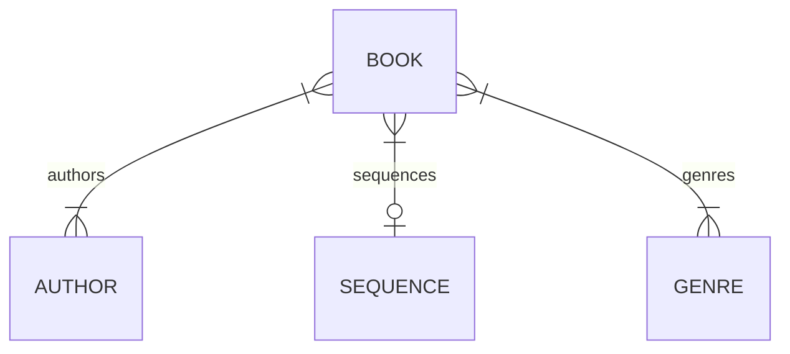

# <logos-ktor-icon /> and &lt;<span style="color: #3d72d7">/</span>&gt; htm<span style="color: #3d72d7">x</span>

## The match made on heaven

Pasha Finkelshteyn

---

# Who am I anyways

<v-clicks>

- ex-JetBrains
- Kotlin fanboy, >10 years
- Polyglot developer
- Full-stack developer (????)
- I don't like <logos-css-3-official /> and <logos-javascript /> (<logos-typescript-icon /> is awesome tho!)
- I <twemoji-mending-heart/> <logos-spring-icon/>
- When <logos-spring-icon/> I start to experiment

</v-clicks>

---

# Brief introduction to <logos-ktor-icon />

<v-clicks>

- Create asynchronous client and <b>server</b> applications
- Kotlin and Coroutines
- Lightweight and Flexible
- Built and backed by JetBrains

</v-clicks>

---

# Basic example

```kotlin {1|2|3|4|5|8}
fun main() {
	embeddedServer(Netty, port = 8000) {
		routing {
			get ("/") {
				call.respondText("Hello, world!")
			}
		}
	}.start(wait = true)
}
```

---

# Plugins: Content Negotiation

- Content negotiation

```kotlin {all|2|3|4|5-6}
fun main() {
    embeddedServer(Netty, port = 8080) {
        install(ContentNegotiation) {
          json(Json {
            prettyPrint = true
            isLenient = true
          })
        }
        // ...
    }.start(wait = true)
}

```

---

# Plugin: Content Negotiation

And then
```kotlin {1|2-3|4}
get("/customer/{id}") {
    val id = call.parameters["id"]
    val customer: Customer = customerStorage.find { it.id == id!!.toInt() }!!
    call.respond(customer)
}
```

Ktor uses the `Accept` header to choose the required serializer

---

# Plugin: Webjars

https://www.webjars.org


---

# Plugin: Webjars

```kotlin {all|2-3}
fun Application.module() {
    install(Webjars) {
        path = "assets"
    }
}
```
And then 
```html
<head>
    <link rel="stylesheet" href="/assets/bootstrap/bootstrap.css">
</head>
```

---

# Plugin: compression

```kotlin {2|3-5|7-9}
fun Application.http() {
    install(Compression) {
        gzip {
            matchContentType()
            priority = 1.0
        }
        deflate {
            priority = 10.0
            minimumSize(1024) // condition
        }
    }
}
```

---

# Plugin: Call logging

```kotlin {all|2|3-5}
fun Application.monitoring() {
  install(CallLogging) {
    level = Level.INFO
    filter { call -> call.request.path().startsWith("/") }
    callIdMdc("call-id")
  }
}
```

---

# DI

Since I'm spoiled wit Spring, I can't live without DI

```kotlin
embeddedServer(Netty, port = 8080) {
  di { 
    bind<Random> { singleton { SecureRandom() } } 
  }
}.start(true)
```

And then

```kotlin
routing {
  controller { MyFirstDIController(instance()) } 
  controller("/protected") { MySecondDIController(instance()) } 
}
```

---

# Our example: library

- I have a library in "obscure russian"© fb2 format
- I need a web interface for it
- And OPDS interface for it

---
layout: statement
---

# Pasha, show the code!

---

# Domain



---
clicks: 3
---

# BTW I use jOOQ

https://jooq.org

> jOOQ generates Java code from your database and lets you build type safe SQL queries through its fluent API.


<div class="grid grid-cols-2 grid-rows-1 gap-4 w-full">
  <div class="box">
  
```sql {1|2|3|all}
SELECT AUTHOR_ID, COUNT(*)
FROM BOOK
GROUP BY AUTHOR_ID
```
  
  </div>
  <div class="box">
  
```kotlin {1|2|3-4|all} {at:0}
create.select(BOOK.AUTHOR_ID, count())
      .from(BOOK)
      .groupBy(BOOK.AUTHOR_ID)
      .fetch();
```
  
  </div>
</div>